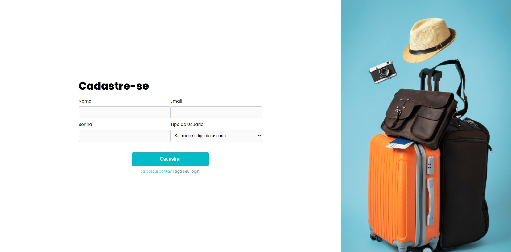
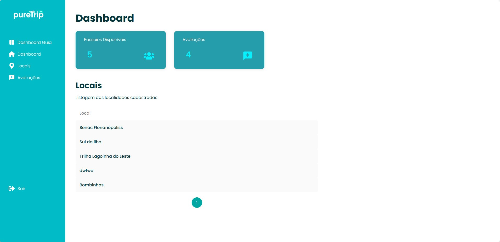

## Viagem 365 - Pure Trip
### Front-End

O projeto tem como objetivo pro usuário Turista olhar passeios
cadastrados, onde ele poderá fazer sua reserva, adicionar avaliação sobre o passeio e olhar avaliações de outros usuários que experimentaram aquele passeio também.

🛠️ Foi desenvolvido com:

    React + Vite      
    HTML    
    CSS     
    JavaScript

🎬 Para rodar o repositório:

    🐑 Clone o repositório
    📦 Instale as dependências:
        npm install

📽️ Para rodar o repositório em ambiente local:

    npm run dev

🛝 Acesse pelo navegador:
    http://localhost:5173

## Tela Login

## Tela Cadastro

## Tela Dashboard

